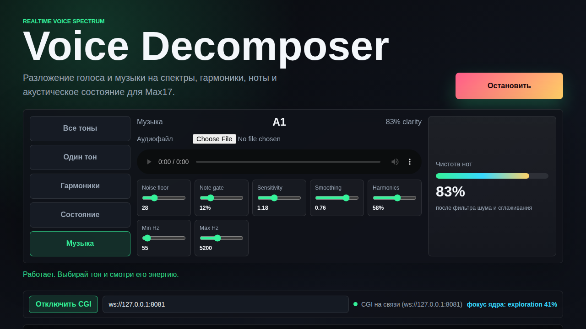

# Voice Decomposer (Max17)

Разложение голоса и музыки на частоты, гармоники, ноты и акустическое состояние —
в реальном времени, прямо в браузере.



## Пять режимов декодирования

| режим | что показывает |
|---|---|
| **Все тоны** | спектр в 50 логарифмических полосах 80–4200 Hz, каждая подписана нотой |
| **Один тон** | одна выбранная полоса: уровень, нота, диапазон частот |
| **Гармоники** | спектральные пики с интерполяцией бина, основной тон и ряд обертонов |
| **Состояние** | энергия, фокус, уверенность, теплота, возбуждение, напряжение, усталость |
| **Музыка** | распознавание нот (MIDI 33–108), хрома-вектор, семь настроек чувствительности |

Плюс спектрограмма-история (144 кадра, своя для каждого режима) и загрузка
аудиофайла вместо микрофона.

## Мост в CGI-Core

Панель под статусом подключает страницу к ядру [cgi-core](https://github.com/mironmotor/cgi-core)
по WebSocket (по умолчанию `ws://127.0.0.1:8081`). Кадры активного режима уходят
в ядро не чаще 4 раз в секунду, ядро декодирует их в намерения и возвращает свой
фокус — он отображается тут же, рядом со статусом.

```bash
# терминал 1 — ядро
cd cgi-core && npm install && npm start

# терминал 2 — страница
cd neuron-motor && python3 -m http.server 8000
```

Открой <http://127.0.0.1:8000/?cgi=1> — мост подключится сам. Другой адрес ядра:
`?cgi=ws://192.168.0.10:8081` или вручную в поле рядом с кнопкой.

Ядро видит ровно те же пять режимов: `all`, `solo`, `harmonics`, `state`, `music`.
Формат кадров описан в `cgi-bridge.js` (`buildCgiPayload`) и в `max17_decoder.js` ядра.

## Как запустить локально

```bash
python3 -m http.server 8000
# или
npx serve .
```

Открой <http://localhost:8000>. Микрофон работает на `localhost` и на HTTPS.

## Деплой на GitHub Pages

Settings → Pages → Source: ветка `master`, папка `/ (root)`. Через 1–2 минуты
страница доступна по `https://<юзер>.github.io/<репо>/`, микрофон запрашивается
автоматически (HTTPS). Мост в CGI при этом требует ядро, доступное с той же
машины (или `wss://`-адрес).

## Телеметрия

Для внешних потребителей страница отдаёт последние кадры:

- `window.__voiceState` / `window.getVoiceStateSnapshot()` — акустическое состояние
- `window.__musicState` / `window.getMusicSnapshot()` — ноты и хрома
- скрытые `<output id="voiceStatePayload">` и `<output id="musicPayload">` — тот же JSON строкой

## Планируемые улучшения

- [x] Определение основной частоты (pitch detection)
- [x] Распознавание нот и хрома-вектор
- [x] Мост в CGI-Core
- [ ] Фильтры (вырезать низкие/высокие тона)
- [ ] Запись аудио
- [ ] Экспорт спектрограммы

## Технологии

Web Audio API, Canvas 2D, WebSocket, vanilla JavaScript — без фреймворков и сборки.

## Лицензия

MIT
